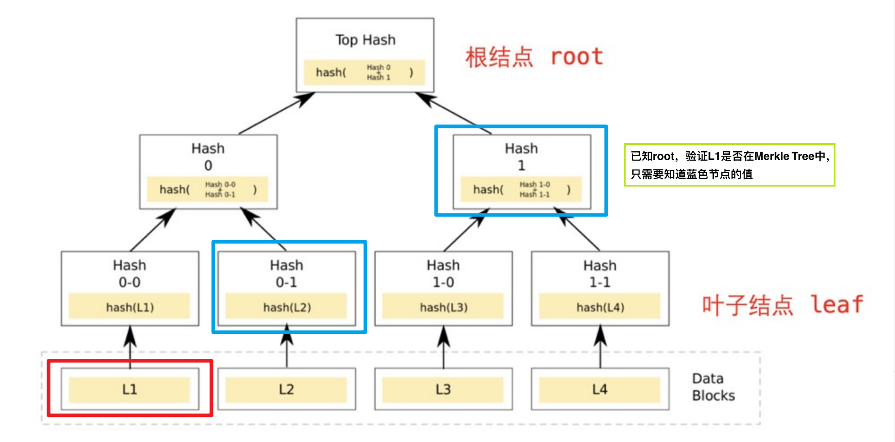
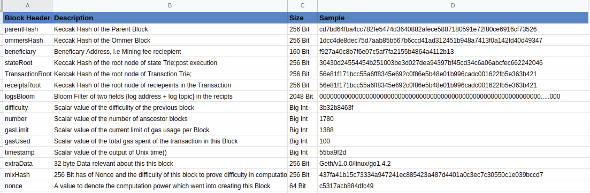
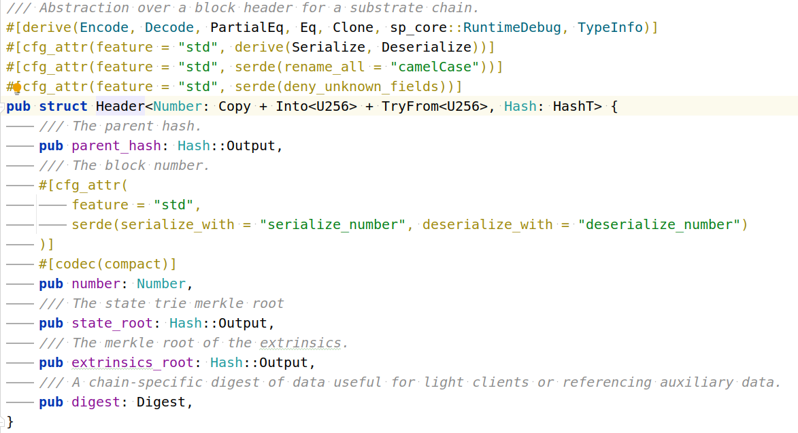
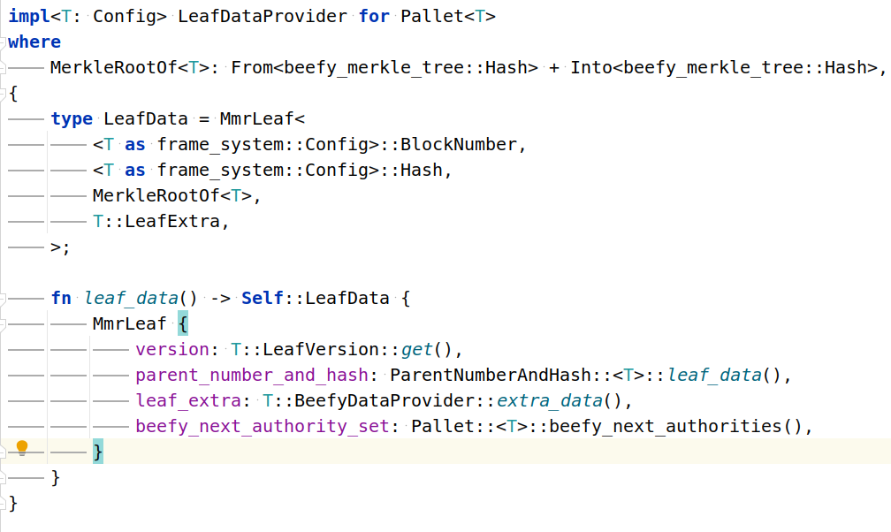
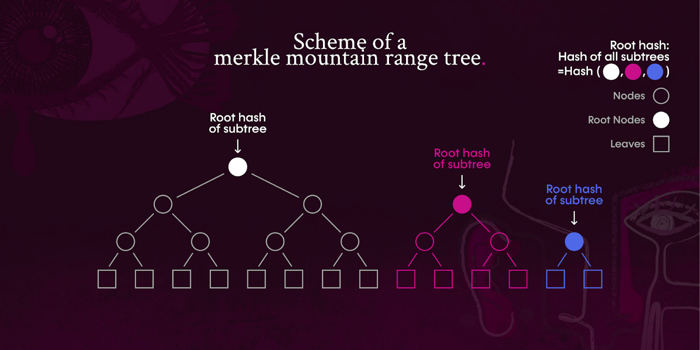
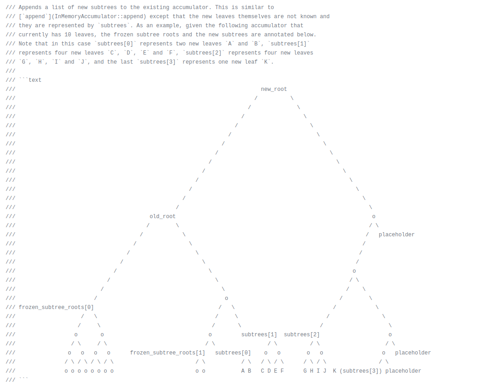

# ChainX-Aptos/Sui assets bridge based on ultra-light node

# 1. Introduction:

**The security problem of the cross-chain bridge mainly lies in the assets withdrawal operation of the cross-chain bridge**

The implementation of multi-signature escrow is simple. The contract owner or multi-signature account controls the withdrawal 
authority and is centralized. Once the private key is leaked, it will lead to the theft of cross-chain bridge assets.

In the cross-chain bridge based on light-node, the withdrawal authority is completely handed over to the light node algorithm, 
and the withdrawal authority is completely decentralized and has the highest security (never heard that the cross-chain bridge 
based on light nodes was stolen).

# 2. Basis of light node:


**merkle verification triples: (merkle_leaf, merkle_proof, merkle_root)**

*Reference:*

[*https://wtf.academy/docs/MerkleTree/*](https://wtf.academy/docs/MerkleTree/)

# 3. Basic idea of light node in contracts:

**Relayer**: Commit (**Anyone can commit**) merkle_leaf(origin data) and its merkle_proof which are on the Source chain

**Prover**: Commit (**Anyone can commit**) merkle_root which is on the Source chain

**On the Target chain, the light node contract combines the Relayer and Prover data to perform merkle verification, 
and the cross-chain bridge withdrawal operation can be performed only after the verification.**

# 4. POW light node

## (1) Bitcoin light node

BlockHeader


```txt
Prover:
80 bytes per block header (average 80 bytes for 10 minutes)
Based on the POW algorithm and the longest chain selection strategy, 
it is almost impossible for Relayer to forge the block header of the main network

Relayer:
transaction + proof_of_transaction
```

## (2) Ethereum1.x light node

BlockHeader



```txt
Prover:
at least 508 bytes per block header (average 508*5*10=25400 bytes for 10 minutes)
Based on the POW algorithm and the longest chain selection strategy, 
it is almost impossible for Relayer to forge the block header of the main network

Relayer:
eventLog + receipt_proof
```

why not transaction_proof?

Bitcoin's transaction merkle tree uses successful transactions,
The transaction merkle tree of ethereum 1.x may contain failed transactions and cannot be used as payment verification.

why not state_proof?

Simply, for normal transfer, `state_proof can only prove that account A has 100 ETH, but it cannot prove that B has transferred 5 ETH to A`.
To solve this problem, a contract needs to be constructed, save `B transfer to A 5 ETH` to the contract, usually use `event`.
At this time, `receipt_root` will be used (`event` exists in `receipt`).
Although it is possible to construct special data structure storage `B transfer to A 5 ETH`,
and get the proof of existence through `eth_getProof`, but compared with `event`,
there is no advantage and the implementation is complicated.

ETH1.x does not directly provide apis for payment verification.
`Relayer` needs to construct receipt merkle tree according to `transactionReceipts` in `Block`,
and find the corresponding receipt according to the event, then generate the receipt merkle proof.

*Reference:*

Proving the Existence of Logs to the Blockchain

[https://ethereum.stackexchange.com/questions/16117/proving-the-existence-of-logs-to-the-blockchain](https://ethereum.stackexchange.com/questions/16117/proving-the-existence-of-logs-to-the-blockchain)

Near RainBow

[https://github.com/aurora-is-near/rainbow-bridge/blob/a75b1d2bef489a982329dd799a2dc9984c24e5d0/eth2near/eth2near-block-relay/eth-proof-extractor.js#L70](https://github.com/aurora-is-near/rainbow-bridge/blob/master/eth2near/eth2near-block-relay/eth-proof-extractor.js#L70)

## (3) Intro XBTC

- BTC(Bitcoin, POW) ⇒  XBTC(ChainX, POS) 

  `Bitcoin light node on ChainX`

- XBTC(ChainX, POS) ⇒ BTC(Bitcoin, POW)

  `Threshold Signature Based on Schnorr on ChainX`

# 5. POS light node

Unlike the POW network (Hash computing power guarantees security), 
the security of the POS network is determined by the set of validators.

To maintain the same security as the POS mainnet, 
the block header of the POS light node should contain at least `2/3` of the validator signatures.

## (1) Substrate light node based on Grandpa

BlockHeader



Suppose there are 30 validators

```txt
version 1

Prover: 
136 bytes per block header + additional 1280 bytes of signature data (30*2/3=20 validators, 64 bytes) = 1416 bytes
(average 10 minutes 1416*10*10=141600 bytes)

Relayer: 
data on chain + state_proof
```

The above idea has the following disadvantages:

(1) 30 validator public keys need to be initialized on the chain, and the change of the validator set is not considered.

(2) Each block header must be accompanied by at least 20 validator signatures.

(3) Each block header needs to be imported, and all need to be imported sequentially.

(4) Due to the need for a large amount of block header data, the cost is high.

**Can be summed up in 3 key questions**

**(1) A block header is confirmed by at least 2/3 of the validator signatures, how to perform low-cost verification (reduce data).**

**(2) How to reduce the number of block headers (reduce data).**

**(3) How to follow up on validator set changes (keep it safe).**

## (2) Substrate ultra-light node based on Beefy+MMR
Beefy payload



Merkle Mountain Ranges



In Substrate, each validator holds a different type of private key, and for ultra-light node business, beefy private key is used.

MMR is Merkle Mountain Ranges, which is a way of Merkelizing the block header,
It is a accumulator (MMR root hash) that changes continuously as the block header grows.

Improvements for version 1:

(1) Through Beefy+MMR, the validator set update is regarded as a beefy off-chain transaction (2/3 validator signatures),
The period of each beefy off-chain transaction is larger (reduces the amount of data).

(2) Through Beefy+MMR, each Beefy off-chain transaction cycle is used to calculate the MMR of the block header,
And save the MMR root to the beefy signed data.

(3) The ultra-light node contract passes the interactive verification (first submit a beefy off-chain transaction signature,
The contract randomly selects some validators, and then lets Relayer provide the signature data of these validators) to reduce the verification cost.

(4) The ultra-light node contract only needs to update the latest MMR root.

```txt
Version 2

Prover:
Beefy off-chain transaction data + two-stage interactive verification

Relayer:
(1) If the Beefy off-chain transaction data already contains the corresponding data (beefy transactions can contain custom extra_data),
    Relayer is not required (Prover already provides)
(2) If not (Prover only provides MMR root)
    Block header + MMR_proof of block header + on-chain data + state_proof
```

*Reference:*

merkle-mountain-range

[https://github.com/opentimestamps/opentimestamps-server/blob/master/doc/merkle-mountain-range.md](https://github.com/opentimestamps/opentimestamps-server/blob/master/doc/merkle-mountain-range.md)

merkle-mountain-range impl

[https://github.com/nervosnetwork/merkle-mountain-range](https://github.com/nervosnetwork/merkle-mountain-range)

Merkle Mountain Ranges docs

[https://docs.composable.finance/products/centauri/merkle-mountain-ranges.html](https://docs.composable.finance/products/centauri/merkle-mountain-ranges.html)

GRANDPA BEEFY Light Client

[https://hackmd.kahub.in/Nx9YEaOaTRCswQjVbn4WsQ?view](https://hackmd.kahub.in/Nx9YEaOaTRCswQjVbn4WsQ?view)

snowbridge

[https://github.com/Snowfork/snowbridge](https://github.com/Snowfork/snowbridge)

darwinia-network

[https://github.com/darwinia-network/darwinia-messages-sol/tree/master/contracts/bridge/src/spec](https://github.com/darwinia-network/darwinia-messages-sol/tree/master/contracts/bridge/src/spec)

## (3) ETH2 beacon light node

ETH2 BeaconBlockHeader 

```txt
class Eth1Data(Container):
    deposit_root: Root
    deposit_count: uint64
    block_hash: Bytes32
class BeaconBlockBody(Container):
    randao_reveal: BLSSignature
    eth1_data: Eth1Data  # Eth1 data vote
    graffiti: Bytes32  # Arbitrary data
    # Operations
    proposer_slashings: List[ProposerSlashing, MAX_PROPOSER_SLASHINGS]
    attester_slashings: List[AttesterSlashing, MAX_ATTESTER_SLASHINGS]
    attestations: List[Attestation, MAX_ATTESTATIONS]
    deposits: List[Deposit, MAX_DEPOSITS]
    voluntary_exits: List[SignedVoluntaryExit, MAX_VOLUNTARY_EXITS]
class BeaconBlock(Container):
    slot: Slot
    proposer_index: ValidatorIndex
    parent_root: Root
    state_root: Root
    body: BeaconBlockBody

class SyncCommittee(Container):
    pubkeys: Vector[BLSPubkey, SYNC_COMMITTEE_SIZE]
    aggregate_pubkey: BLSPubkey
```

(1) The ETH2 beacon chain is also POS consensus and implements BLS aggregated signatures.

(2) The BLS12-381 aggregate signature data of the validator set (the committee of each Epoch) is only 96 bytes,
Verification is more complicated (use time for space).

(3) SyncCommittee tracks changes to committees.

```txt
Version 3

Prover:
Beacon chain block header (eth1_data) + SyncCommittee (including BLS signature)

Relayer:
ETH1 chain block + eventLog + receipt_proof
```

*Reference:*

Eth2.0 Beacon Light Clients

[https://github.com/ethereum/consensus-specs/blob/dev/specs/altair/light-client/full-node.md](https://github.com/ethereum/consensus-specs/blob/dev/specs/altair/light-client/full-node.md)

Eth2.0 Light Clients

[https://hackmd.io/@wemeetagain/SkuswKu_r](https://hackmd.io/@wemeetagain/SkuswKu_r)

ETH2.0 spec

[https://github.com/ethereum/consensus-specs/blob/dev/specs/phase0/beacon-chain.md#introduction](https://github.com/ethereum/consensus-specs/blob/dev/specs/phase0/beacon-chain.md#introduction)

eth2-annotated-spec

[https://benjaminion.xyz/eth2-annotated-spec/phase0/beacon-chain/#eth1data](https://benjaminion.xyz/eth2-annotated-spec/phase0/beacon-chain/#eth1data)

ethereum-beacon-client

[https://github.com/litemaker/snowbridge/tree/main/parachain/pallets/ethereum-beacon-client](https://github.com/litemaker/snowbridge/tree/main/parachain/pallets/ethereum-beacon-client)

# 6. ChainX and Aptos ultra-light node

## (1) ChainX(work in process)

**Substrate Beefy is implementing BLS signing**

[https://github.com/paritytech/substrate/pull/11574](https://github.com/paritytech/substrate/pull/11574)

After it is perfected, **Based on the Beefy + MMR + BLS, we can implement ChainX ultra-light node on Aptos**

_Requires ChainX mainnet upgrade to support Beefy + MMR + BLS_

## (2) Aptos(work in process)

Aptos has no BlockHeader

Aptos uses the History Tree (similar to MMR) to Merkelize each transaction


Aptos uses BLS12-381 aggregated signatures


However, there is currently a lack of aggregated signatures when validators change

After it is perfected, **Base on BLS + History_Tree, we can implement Aptos ultra-light node on ChainX**

*Reference:*

History Tree source code

[https://github.com/aptos-labs/aptos-core/tree/main/types/src/proof](https://github.com/aptos-labs/aptos-core/tree/main/types/src/proof)

History Tree

[https://www.usenix.org/legacy/event/sec09/tech/full_papers/crosby.pdf](https://www.usenix.org/legacy/event/sec09/tech/full_papers/crosby.pdf)

# 7. Transfer mode of the bridge assets

The cross-chain bridge is essentially an intermediary. The user first transfers the original assets to the cross-chain 
bridge on the source chain, then the cross-chain bridge transfers the mirror asset to the user on the target chain (the 
cross-chain bridge guarantees a 1:1 exchange between the original asset and the mirror asset),
Simplifies to the `transfer-transfer` model.

According to the specific implementation scheme of `transfer`, it can be divided into the following 3 modes

1. **withdraw-deposit**

    ```txt
    Withdraw: Minus the user's original asset balance on the Source chain
    Deposit: Add the user's mirror asset balance on the Target chain
    
    Do the same in the opposite direction, that is:
    Withdraw: Minus the user's mirror asset balance on the Target chain
    Deposit: Add the user's original asset balance on the Source chain
    
    Whether to escrow assets: In this mode, the cross-chain bridge contract does not escrow any assets.
    Law of Conservation: The sum of asset balances on both chains is conserved.
    Usage scenario: As a creator of cross-chain assets, it is usually only used when the minting rights on the Source and 
                   Target chains are mastered at the same time.
   
    Advantage 1: The security of assets on the Source and Target chains is in their own hands (such as the exchange of mirror assets and original assets).
    Advantage 2: It is convenient to monitor the safety of the cross-chain bridge (according to the law of conservation).
    Advantage 3: It is convenient to graft your own application.
    Disadvantages: Not flexible enough, when the created cross-chain assets are not recognized by the market (without a 
                   large number of applications), it cannot be improved.
    ```

2. **lock-mint-burn-unlock**

    ```txt
    Lock: On the Source chain, the user transfers the original assets to the cross-chain bridge contract for escrow
    Mint: On the Target chain, the cross-chain bridge mint the same amount of mirror assets to the user
    
    Operate in the opposite direction:
    Burn: On the Target chain, the user burns the corresponding mirror assets
    Unlock: On the Source chain, the cross-chain bridge transfers the same amount of original assets to the user

    Whether to escrow assets: In this mode, the cross-chain bridge contract only escrow assets on the Source chain
    Law of Conservation: Over a period of time, it can always be observed that the balance of the original assets escrow 
                        by the cross-chain bridge on the Source chain is equal to the total amount of mirror assets on the Target chain
    Usage scenario: As the creator of cross-chain assets, it is usually only used when you have the right to mint assets on the Target chain.
   
    Advantage 1: The security of assets on the Source and Target chains is in their own hands (such as the exchange of mirror assets and original assets).
    Advantage 2: It is convenient to monitor the safety of the cross-chain bridge (according to the law of conservation).
    Advantage 3: It is convenient to graft your own application.
    Disadvantages: Not flexible enough, when the created cross-chain assets are not recognized by the market 
                  (without a large number of applications), it cannot be improved.
    ```

3. **lock-unlock**

    ```txt
    Lock: On the Source chain, the user transfers the original assets to the cross-chain bridge contract for escrow
    Unlock: On the Target chain, the cross-chain bridge transfers the same amount of mirror assets to users
    
    Do the same in the opposite direction, that is:
    Lock: On the Target chain, the user transfers the mirror assets to the cross-chain bridge contract for escrow
    Unlock: On the Source chain, the cross-chain bridge transfers the same amount of original assets to the user
    
    Whether to escrow assets: In this mode, the cross-chain bridge escrow assets on the Source and Target chains at the same time
    Law of Conservation: Cannot be observed accurately
    Usage scenario: As a user of cross-chain assets, it is only used when it is not necessary to master the minting rights on the Source and Target chains
   
    Advantages: Flexible, can keep up with the most recognized cross-chain assets in the market through configuration
    Disadvantage 1: The security of assets on the Target chain is not in their own hands (such as the exchange of mirror assets and original assets)
    Disadvantage 2: It is impossible to monitor whether the cross-chain bridge is normal from the balance of the assets 
                    escrow by the cross-chain bridge, and additional observation points are required for early warning
    Disadvantage 3: For applications that require high security of their own assets, grafting has certain risks (mainly 
                    the exchange of mirror assets and original assets)
    ```

We choose **lock-unlock mode**, which can adapt to the needs of different periods.
