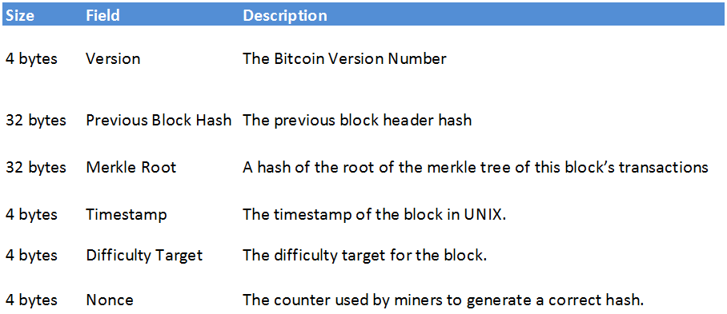
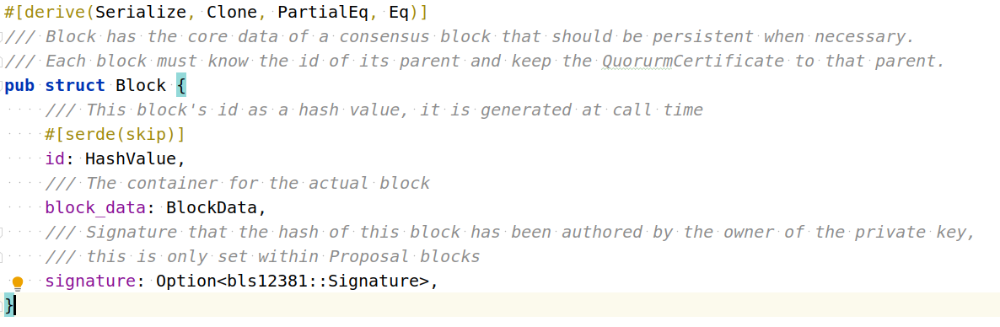

# 基于超轻节点的ChainX-Aptos/Sui资产跨链桥设计

# 一、引言:

**跨链桥的安全性问题主要出在跨链桥的出金操作**

公证人多签托管实现简单, 合约owner或多签账户控制出金权限且集中, 一旦私钥泄露, 将导致跨链桥资产被盗. 

而基于轻节点的跨链桥, 出金权限完全交给轻节点算法, 出金权限做到了完全的去中心化, 安全性最高(从未听说基于轻节点的跨链桥被盗).

# 二、轻节点实现的基础: merkle tree


**merkle验证三元组(merkle_leaf, merkle_proof, merkle_root)**

*参考*

[*https://wtf.academy/docs/MerkleTree/*](https://wtf.academy/docs/MerkleTree/)

# 三、在合约中实现轻节点的基本思路

**Relayer**: 一路提交(**任何人都可以提交**)Source链上merkle_leaf(原始数据)及其merkle_proof.

**Prover**: 另一路提交(**任何人都可以提交**)Source链上merkle_root.

**在Target链上, 轻节点合约结合Relayer和Prover两路数据进行merkle验证, 校验通过方可执行跨链桥出金操作.**

# 四、POW轻节点

## (1) Bitcoin轻节点

区块头



```txt
Prover:
每个区块头 80字节(平均10分钟80字节)
基于POW工作量证明算法和最长链选择策略, 确保Relayer几乎不可能伪造主网的区块头

Relayer:
transaction + proof_of_transaction
```

## (2) Ethereum1.x 轻节点

区块头


```txt
Prover:
每个区块头至少508字节(平均10分钟508*5*10=25400字节)
基于POW工作量证明算法和最长链选择策略, 确保Relayer几乎不可能伪造主网的区块头

Relayer:
eventLog + receipt_proof
```

为什么不是transaction_proof?

bitcoin的 transaction merkle tree用的都是成功的交易, 
而ethereum的transaction merkle tree有可能包含了失败的交易,不能做为支付验证.

为什么不是state_proof?

简单地说, 对于普通转账, `state_proof只能证明账户A有100 ETH, 却不能证明B转给了A 5 ETH`.
为了解决这个问题, 需要构造一个合约, 将 `B转给A 5ETH` 存到合约上, 通常是event形式
这个时候就会用到receipt_root(event存在receipt中). 虽然理论上可以在合约中构造特殊的
数据结构存储`B转给A 5ETH`, 并通过eth_getProof获得存在性证明, 但和event方式相比并
没有优势且实现复杂.

ETH1.x 没有直接提供支付验证的api. 
Relayer根据block中的transactionReceipts构造receipt merkle tree, 
根据event找到相应的receipt, 再生成receipt merkle证明.

*参考:*

eventLog 存在性证明讨论

[https://ethereum.stackexchange.com/questions/16117/proving-the-existence-of-logs-to-the-blockchain](https://ethereum.stackexchange.com/questions/16117/proving-the-existence-of-logs-to-the-blockchain)

Near RainBow

[https://github.com/aurora-is-near/rainbow-bridge/blob/a75b1d2bef489a982329dd799a2dc9984c24e5d0/eth2near/eth2near-block-relay/eth-proof-extractor.js#L70](https://github.com/aurora-is-near/rainbow-bridge/blob/master/eth2near/eth2near-block-relay/eth-proof-extractor.js#L70)

## (3) XBTC简介

- BTC(Bitcoin, POW) ⇒  XBTC(ChainX, POS) 

   Bitcoin轻节点

- XBTC(ChainX, POS) ⇒ BTC(Bitcoin, POW)

   基于Schnorr聚合签名的门限签名

# 五、POS轻节点

与POW网络(Hash算力保证安全)不同的是, POS网络的安全是由验证人集合决定的.

要和POS主网保持同样的安全性,POS轻节点的区块头至少应包含三分之二的验证人签名.

## (1) 基于Grandpa的substrate轻节点

区块头


假设有30个验证人

```txt
版本1

Prover: 
每个区块头136字节+ 额外的1280字节的签名数据(30*2/3=20个验证人, 64字节) = 1416字节
(平均10分钟 1416*10*10=141600字节)

Relayer: 
链上数据 + state_proof
```

上面的方案有以下缺点:

(1) 需要将30个验证人公钥初始化到链上,且未考虑验证人集合变更的情况.

(2) 每个区块头都要附带至少20个验证人签名.

(3) 每个区块头都需要导入,而且都需要顺序导入.

(4) 由于需要大量的区块头数据, 成本高.

**可以总结为三个关键问题**

**(1)  一个区块头至少被2/3的验证人签名确认, 如何进行低成本验证(减少数据).**

**(2)  如何减少区块头数量(减少数据).**

**(3)  如何跟进验证人集合变更(保持安全).**

## (2) 基于Beefy+MMR的substrate超轻节点

Beefy payload


Merkle Mountain Ranges


在Substrate中, 每个验证人持有不同类型的私钥, 针对超轻节点业务, 使用的是beefy私钥.

MMR即 Merkle Mountain Ranges(merkle山脉), 是对区块头进行默克尔化的一种方式, 
是一个随区块头增长而不断改变的累积量(MMR root hash).

针对版本1的改进:

(1) 通过Beefy+MMR, 将验证人集合更新当做一笔beefy链下交易(2/3验证人签名), 
每笔beefy链下交易的周期更大(减少数据量).

(2) 通过Beefy+MMR, 每个beefy链下交易周期, 进行区块头的MMR计算, 
并将MMR root存到beefy签名的数据中.

(3) 超轻节点合约通过交互式验证(先提交一个beefy链下交易签名, 
合约随机选择部分验证人, 再让Relayer提供这些验证人的签名数据)来减少验证成本.

(4) 超轻节点合约只需要更新最新的MMR root即可.

```txt
版本2

Prover:
Beefy链下交易数据 + 两阶段交互式验证

Relayer:
(1) 如果Beefy链下交易数据中已包含相应的数据(beefy交易可以包含自定义的extra_data), 
    则不需要Relayer(Prover已提供)
(2) 如果Beefy链下交易数据中没有相应的数据(Prover只提供了MMR root)
    区块头 + 区块头的MMR_proof + 链上数据 + state_proof
```

*参考:*

merkle-mountain-range

[https://github.com/opentimestamps/opentimestamps-server/blob/master/doc/merkle-mountain-range.md](https://github.com/opentimestamps/opentimestamps-server/blob/master/doc/merkle-mountain-range.md)

merkle-mountain-range impl

[https://github.com/nervosnetwork/merkle-mountain-range](https://github.com/nervosnetwork/merkle-mountain-range)

Merkle Mountain Ranges docs

[https://docs.composable.finance/products/centauri/merkle-mountain-ranges.html](https://docs.composable.finance/products/centauri/merkle-mountain-ranges.html)

GRANDPA BEEFY Light Client

[https://hackmd.kahub.in/Nx9YEaOaTRCswQjVbn4WsQ?view](https://hackmd.kahub.in/Nx9YEaOaTRCswQjVbn4WsQ?view)

snowbridge

[https://github.com/Snowfork/snowbridge](https://github.com/Snowfork/snowbridge)

darwinia-network

[https://github.com/darwinia-network/darwinia-messages-sol/tree/master/contracts/bridge/src/spec](https://github.com/darwinia-network/darwinia-messages-sol/tree/master/contracts/bridge/src/spec)

## (3) ETH2 信标链轻节点(Beacon Light Node )

ETH2 信标链区块头

```txt
class Eth1Data(Container):
    deposit_root: Root
    deposit_count: uint64
    block_hash: Bytes32
class BeaconBlockBody(Container):
    randao_reveal: BLSSignature
    eth1_data: Eth1Data  # Eth1 data vote
    graffiti: Bytes32  # Arbitrary data
    # Operations
    proposer_slashings: List[ProposerSlashing, MAX_PROPOSER_SLASHINGS]
    attester_slashings: List[AttesterSlashing, MAX_ATTESTER_SLASHINGS]
    attestations: List[Attestation, MAX_ATTESTATIONS]
    deposits: List[Deposit, MAX_DEPOSITS]
    voluntary_exits: List[SignedVoluntaryExit, MAX_VOLUNTARY_EXITS]
class BeaconBlock(Container):
    slot: Slot
    proposer_index: ValidatorIndex
    parent_root: Root
    state_root: Root
    body: BeaconBlockBody

class SyncCommittee(Container):
    pubkeys: Vector[BLSPubkey, SYNC_COMMITTEE_SIZE]
    aggregate_pubkey: BLSPubkey
```

(1) ETH2 信标链也是POS共识, 且实现了BLS聚合签名.

(2) 验证人集合(每个Epoch 的 committee)的BLS12-381聚合签名数据只有96字节, 
验证较复杂(时间换空间).

(3) SyncCommittee 可跟踪 committee的变更.

```txt
版本3

Prover: 
信标链区块头(eth1_data) + SyncCommittee(含BLS签名)

Relayer:
ETH1链区块 + eventLog + receipt_proof
```

*参考:*

Eth2.0 Beacon Light Clients

[https://github.com/ethereum/consensus-specs/blob/dev/specs/altair/light-client/full-node.md](https://github.com/ethereum/consensus-specs/blob/dev/specs/altair/light-client/full-node.md)

Eth2.0 Light Clients

[https://hackmd.io/@wemeetagain/SkuswKu_r](https://hackmd.io/@wemeetagain/SkuswKu_r)

ETH2.0 spec

[https://github.com/ethereum/consensus-specs/blob/dev/specs/phase0/beacon-chain.md#introduction](https://github.com/ethereum/consensus-specs/blob/dev/specs/phase0/beacon-chain.md#introduction)

eth2-annotated-spec

[https://benjaminion.xyz/eth2-annotated-spec/phase0/beacon-chain/#eth1data](https://benjaminion.xyz/eth2-annotated-spec/phase0/beacon-chain/#eth1data)

ethereum-beacon-client

[https://github.com/litemaker/snowbridge/tree/main/parachain/pallets/ethereum-beacon-client](https://github.com/litemaker/snowbridge/tree/main/parachain/pallets/ethereum-beacon-client)

# 六、ChainX和Aptos超轻节点

## (1) ChainX 超轻节点(完善中)

Substrate Beefy 也在实现BLS签名

[https://github.com/paritytech/substrate/pull/11574](https://github.com/paritytech/substrate/pull/11574)

待其完善后, **基于BLS聚合签名版的Beefy+MMR, 我们可在Aptos上实现ChainX超轻节点**

_需要ChainX主网升级已支持Beefy+MMR_

## (2) Aptos 超轻节点(完善中)

aptos没有区块头的数据结构

aptos 采用了History tree(和MMR的作用类似) 对每笔交易进行默克尔化


aptos 采用了 BLS12-381聚合签名


但是目前缺少验证人变更时的聚合签名

待其完善后, 基于**BLS签名版的History Tree, 我们可在ChainX上实现Aptos超轻节点**

*参考:*

History Tree 源码

[https://github.com/aptos-labs/aptos-core/tree/main/types/src/proof](https://github.com/aptos-labs/aptos-core/tree/main/types/src/proof)

History Tree 论文

[https://www.usenix.org/legacy/event/sec09/tech/full_papers/crosby.pdf](https://www.usenix.org/legacy/event/sec09/tech/full_papers/crosby.pdf)

# 七、 跨链资产转移模式

跨链桥本质是个中介, 用户先在源链上将原始资产转给跨链桥, 
然后跨链桥在目标链上将镜像资产转给用户(由跨链桥保证原始资产和镜像资产1:1兑换),
简化为“transfer-transfer”模型.

根据"transfer"具体的实现方案不同,可分为以下3种模式

1. **withdraw-deposit模式**

    ```txt
    withdraw: 在Source链上对用户原始资产余额做减法
    deposit: 在Target链上对用户镜像资产余额做加法
    反方向同样操作,即:
    withdraw: 在Target链上对用户镜像资产余额做减法
    deposit: 在Source链上对用户原始资产余额做加法
    
    是否托管资产: 这种模式下跨链桥合约并不托管任何资产.
    守恒定律: 资产余额在两条链上的总和守恒.
    使用场景: 做为跨链资产的创造者, 通常只有同时掌握Source和Target链上的铸币权时才会使用.
    优点1: Source和Target链上的资产安全均掌握在自己手里(如镜像资产和原始资产的兑换).
    优点2: 方便监测跨链桥安全(根据守恒定律).
    优点3: 可方便嫁接自己的应用.
    缺点: 不够灵活, 当所创造的跨链资产不被市场认可(无大量应用使用),无法改进.
    ```

2. **lock-mint-burn-unlock模式**

    ```txt
    lock: 在Source链上, 用户将原始资产转移给跨链桥合约托管
    mint: 在Target链上, 跨链桥mint等量的镜像资产给用户
    反方向操作:
    burn: 在Target链上, 用户burn相应的镜像资产
    unlock: 在Source链上, 跨链桥将等量的原始资产转移给用户
    
    是否托管资产: 这种模式下跨链桥在Source链上托管资产,在Target链上不托管任何资产
    守恒定律: 在一段时间内,总能观测到Source链上被跨链桥托管的原始资产余额和Target链上的镜像资产总额相等
    使用场景: 做为跨链资产的创造者, 通常只有掌握Target链上的铸币权时才会使用.
    优点1: Source和Target链上的资产安全均掌握在自己手里(如镜像资产和原始资产的兑换).
    优点2: 方便监测跨链桥安全(根据守恒定律).
    优点3: 可方便嫁接自己的应用.
    缺点: 不够灵活, 当所创造的跨链资产不被市场认可(无大量应用使用),无法改进. 
    ```

3. **lock-unlock模式**

    ```txt
    lock: 在Source链上, 用户将原始资产转移给跨链桥合约托管
    unlock: 在Target链上, 跨链桥将等量的镜像资产转移给用户
    反方向同样操作,即: 
    lock: 在Target链上, 用户将镜像资产转移给跨链桥合约托管
    unlock: 在Source链上, 跨链桥将等量的原始资产转移给用户
    
    是否托管资产: 这种模式下跨链桥在Source和Target链上同时托管资产
    守恒定律: 无法准确观测.
   
    使用场景: 做为跨链资产的使用者, 不需要掌握Source和Target链上的铸币权时才会使用
    优点:  灵活,通过配置可以紧跟市场上最被认可的跨链资产
    缺点1: Target链上的资产安全不掌握在自己手里(如镜像资产和原始资产的兑换)
    缺点2: 从跨链桥托管的资产余额上无法监测跨链桥是否正常,需要额外的观测点做预警
    缺点3: 对于自己资产安全性要求较高的应用,嫁接有一定风险(主要就是镜像资产和原始资产的兑换)
    ```

我们选择**lock-unlock模式**, 可以适应不同时期的需求.
